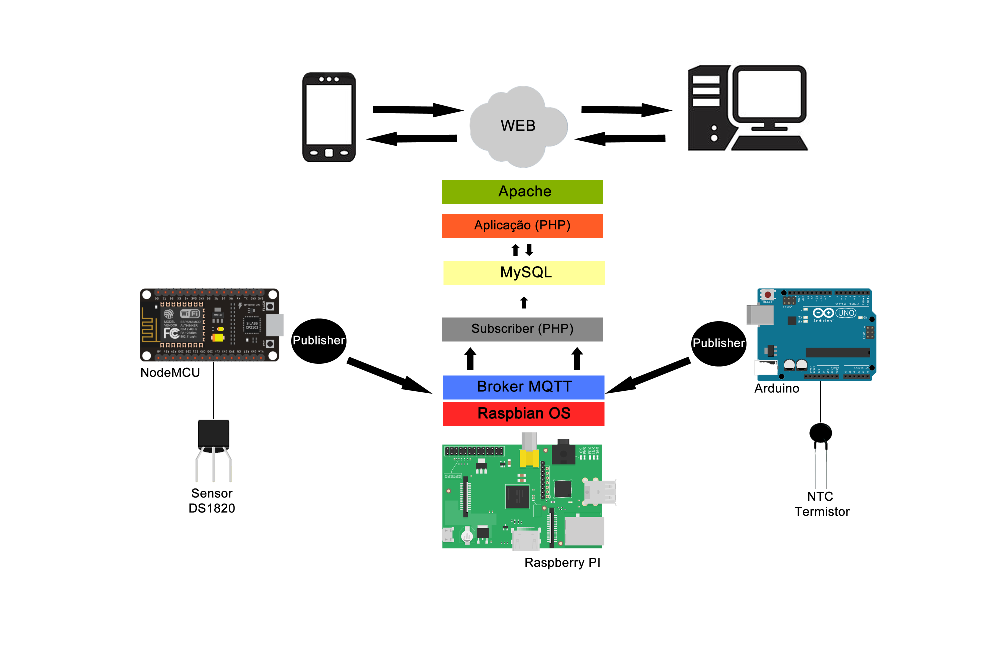

# iot-telemetry-architecture

Historical archive of my postgraduate final paper project (2018):

> **"Proposição de uma arquitetura de comunicação heterogênea, flexível e de baixo custo para aplicações de IoT"**
> André Vinícius Spineli Dolce — Especialização em Engenharia de Software, UNICV (Centro Universitário Cidade Verde), Maringá – PR, Brasil.

The paper proposes and prototypes a heterogeneous, flexible and low-cost communication architecture for IoT applications: collecting, storing and delivering telemetric data (ambient temperatures of a house) from constrained devices.

## Architecture

- **Raspberry Pi** (Raspbian) as the hub: **Mosquitto** MQTT broker, **MySQL** for storage and **Apache + PHP** to serve the collected data as HTML and JSON.
- **Arduino Uno** with an Ethernet shield and an **NTC thermistor** (10 kΩ resistor), publishing temperatures over MQTT.
- **NodeMCU (ESP8266)** with a **DS18B20** sensor (4.7 kΩ resistor), publishing over built-in Wi-Fi.
- A PHP daemon (`server/subscriber.php`) subscribes to the broker and persists every reading; `raspberry/lcd.py` mirrors readings on a 16x2 LCD.

## Results

- **~178,768 temperature records** collected over **~2 months** of continuous operation (see `data/schema.sql`).
- Send-interval tests: at **5s** the PHP subscriber on the Raspberry Pi lagged behind the insert volume; at **10s** storage became more regular; at **60s** it was consistently regular — mapping the practical envelope of the low-cost stack.

## Notes

This repository is a curated historical import — the original local credentials were removed and the code is published as it was written in 2018, as part of the paper's prototype. Not maintained.

## License

MIT
